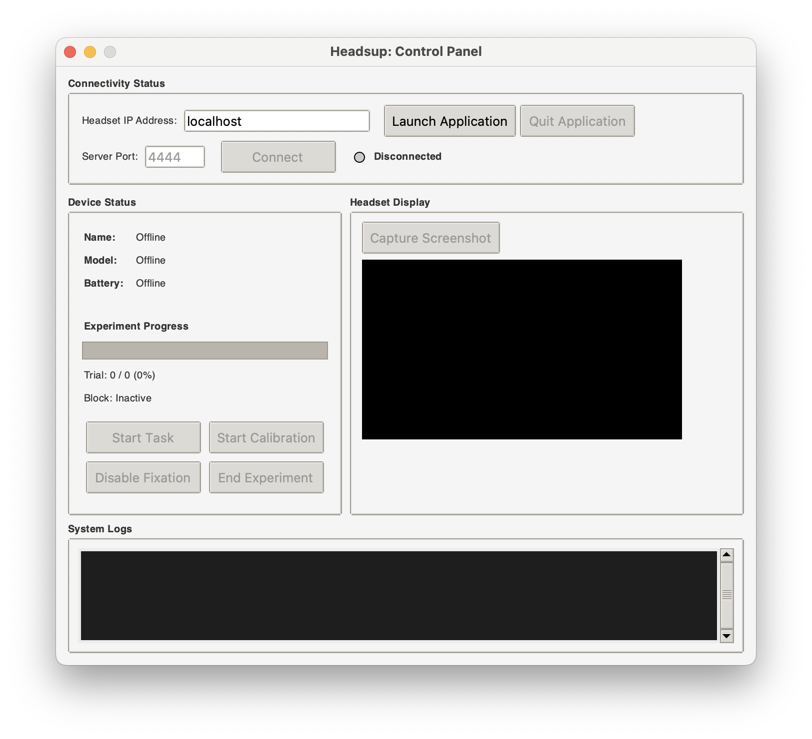

# Headsup

Remote monitoring and control system for Unity VR experiments over LAN. Headsup enables researchers to observe experiment progress, capture screenshots, and manage VR applications from a desktop control panel during behavioral research sessions.



## Overview

Headsup consists of two components:

- **Unity Package**: WebSocket server and screenshot capture system integrated into your VR application
- **Python Client**: Desktop control panel for monitoring and controlling connected VR headsets

The system enables real-time monitoring of experiment status, device information, and application logs while providing remote controls for experiment management.

## Quick Start

### Unity Integration

Install the Unity package via Unity Package Manager:

```text
https://github.com/Brain-Development-and-Disorders-Lab/headsup.git?path=/unity
```

See [unity/README.md](unity/README.md) for complete integration instructions.

### Client Setup

Install the Python client dependencies and run:

```bash
cd client
pip3 install websockets pillow
python3 main.py
```

See [client/README.md](client/README.md) for detailed usage instructions.

## Network Requirements

- Local network allowing peer-to-peer communication
- VR headset and client machine on the same network
- Known IP address of the VR headset (found in device network settings)

Enterprise or centrally-managed networks may restrict peer-to-peer communication. For reliable operation, consider using a dedicated router (e.g., TP-Link Archer AX1500) to create an isolated network for all devices.

## Technical Limitations

Screenshot capture introduces brief delays in VR applications due to main-thread processing requirements. Continuous video streaming is not supported. For alternative streaming solutions, consider [UnityRenderStreaming](https://github.com/Unity-Technologies/UnityRenderStreaming), though performance varies.

## License

<a rel="license" href="http://creativecommons.org/licenses/by-nc-sa/4.0/">
  
</a>
<br />
This work is licensed under a <a rel="license" href="http://creativecommons.org/licenses/by-nc-sa/4.0/">Creative Commons Attribution-NonCommercial-ShareAlike 4.0 International License</a>.

## Contact

**Henry Burgess** <[henry.burgess@wustl.edu](mailto:henry.burgess@wustl.edu)>
